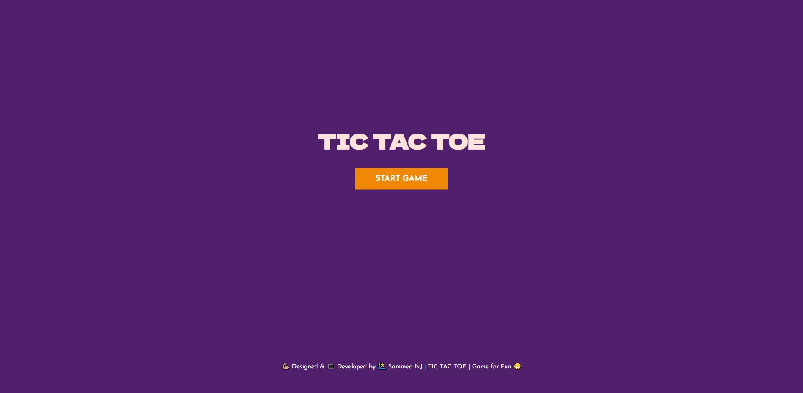
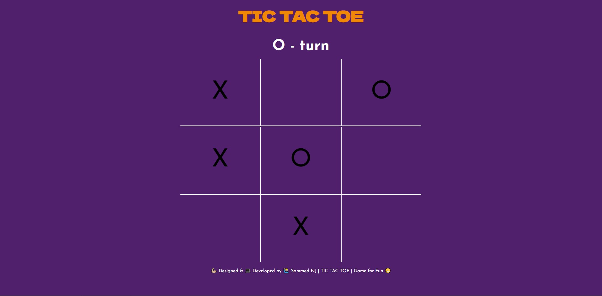
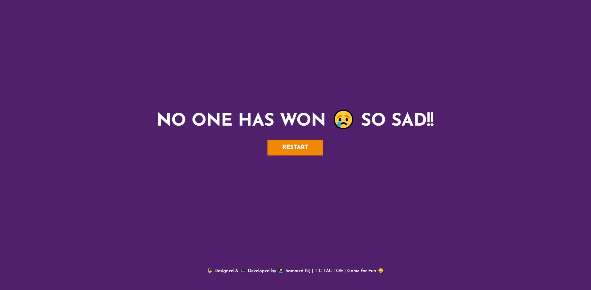

# TIC TAC TOA - For practicing JS I build this. Have fun with it!

## Table of contents

- [Overview](#overview)
  - [The challenge](#the-challenge)
  - [Screenshot](#screenshot)
  - [Links](#links)
- [My process](#my-process)
  - [Built with](#built-with)
  - [What I learned](#what-i-learned)

## Overview

### The challenge

For a beginner opinion:

- It was hard to get around with js in certain areas.
- Even had some problem with css grid, but i figured it out 😊

### Screenshot








### Links

- Solution URL: [https://github.com/Sammed-NJ/tic_tac_too.git](https://github.com/Sammed-NJ/tic_tac_too.git)
- Live Site URL: [https://tic-tac-toe-sammednj.netlify.app/](https://tic-tac-toe-sammednj.netlify.app/)

## My process

### Built with

- HTML5 markup
- CSS custom properties
- Flexbox && Grid
- Mobile-first workflow
- Venila Javascript used for logic

### What I learned

Learned some DOM manipulation and also use of JS function in a proper way,
but I think I didn't much care about DRY 😅

```html
<!-- GAME HEADING -->
<header class="heading" id="heading">
  <h1>TIC TAC TOE</h1>
</header>

<!-- INFO OF GAME -->
<section class="game-intro " id="game-intro">
  <div class="container">
    <h1>TIC TAC TOE</h1>
    <button type="submit" class="start-btn">START GAME</button>
  </div>
</section>

<!-- MAIN SECTION -->
<section class="main-container" id="main-container">
  <!-- GAME AREA -->
  <div class="game-container" id="game-container">
    <h2 class="current-player">X - turn</h2>

    <div class="game-box" id="game-box">
      <div class="box box-0" id="0"></div>
      <div class="box box-1" id="1"></div>
      <div class="box box-2" id="2"></div>
      <div class="box box-3" id="3"></div>
      <div class="box box-4" id="4"></div>
      <div class="box box-5" id="5"></div>
      <div class="box box-6" id="6"></div>
      <div class="box box-7" id="7"></div>
      <div class="box box-8" id="8"></div>
    </div>
  </div>
</section>

<!-- WINNER -->
<div class="winner-container" id="winner-container">
  <div class="container">
    <h1 class="ply-text"></h1>
    <button type="reset" class="game-reset">RESTART</button>
  </div>
</div>

<!-- FOOTER -->
<footer class="game-footer" id="game-footer">
  <p>
    💪🏼 Designed & 💻 Developed by 🙋🏼‍♂️ Sammed NJ | TIC TAC TOE | Game for Fun 😄
  </p>
</footer>
```

```css
/* ---------- BASIC STYLES ------------ */
* {
  margin: 0;
  padding: 0;
  box-sizing: border-box;
  /* font-size: 62.5%; */
}

body {
  background-color: #50206c;
}

.hide {
  display: none;
}

/* ---------- OPENING PAGE STYLES ------------ */
.game-intro {
  min-height: 90vh;
  text-align: center;
}

.game-intro .container {
  width: 90%;
  margin: auto;
  position: absolute;
  top: 40%;
  left: 50%;
  transform: translate(-50%, -50%);
}

.game-intro .container h1 {
  font-family: "Dela Gothic One", cursive;
  color: #ffe3dc;
  font-size: 6ch;
}

.game-intro .container button {
  margin-top: 2rem;
  background: #f18805;
  border: none;
  padding: 1rem 3rem;
  font-family: "Josefin Sans", sans-serif;
  font-size: 2.4ch;
  font-weight: 700;
  cursor: pointer;
  color: white;
  transition: 0.3s ease-in-out;
}

.game-intro .container button:hover {
  background-color: #f0a202;
  transform: translateY(-5%);
}

/* ---------- GAME STARTED HEADING ------------ */

.heading {
  text-align: center;
  padding: 1rem 0;
}

.heading h1 {
  font-family: "Dela Gothic One", cursive;
  color: #f18805;
  font-size: 6ch;
}

/* -------------- MAIN GAME AREA ------------- */

.main-container {
  min-height: 60vh;
}

.main-container .game-container {
  display: flex;
  justify-content: center;
  align-items: center;
  flex-direction: column;
}

.main-container .game-container h2 {
  font-family: "Josefin Sans", sans-serif;
  color: white;
  text-align: center;
  padding: 1rem 0;
  font-size: 6ch;
  margin-top: 0.5rem;
}

.main-container .game-container .game-box {
  width: 40%;
  height: 650px;
  margin: auto;
  display: grid;
  grid-template-columns: repeat(3, 1fr);
}

.main-container .game-container .game-box > div {
  width: 100%;
  height: 215.328px;
  font-family: "Josefin Sans", sans-serif;
  font-size: 10ch;
  font-weight: 400;
  text-align: center;
  display: flex;
  justify-content: center;
  align-items: center;
}

/* ---------- GAME WINNER STYLES ------------ */
.winner-container {
  min-height: 90vh;
}

.winner-container .container {
  display: flex;
  justify-content: center;
  align-items: center;
  flex-direction: column;
  min-height: 90vh;
}

.winner-container .container h1 {
  font-family: "Josefin Sans", sans-serif;
  color: white;
  text-align: center;
  font-size: 7ch;
}

.winner-container .container button {
  margin-top: 2rem;
  background: #f18805;
  border: none;
  padding: 1rem 3rem;
  font-family: "Josefin Sans", sans-serif;
  font-size: 2.4ch;
  font-weight: 700;
  cursor: pointer;
  color: white;
  transition: 0.3s ease-in-out;
}

.winner-container .container button:hover {
  background-color: #f0a202;
  transform: translateY(-5%);
}

/* ---------- FOOTER STYLES ------------ */
footer {
  font-family: "Josefin Sans", sans-serif;
  min-height: 5vh;
  text-align: center;
  padding: 1rem 0;
  color: white;
}

footer p {
  font-size: 1.5ch;
}
```

```js
"use strict";

// SET LOGIC
let spaces = [null, null, null, null, null, null, null, null, null];
const O_text = "O";
const X_text = "X";
let currentPlayer = X_text;
let gameWinnerText = document.querySelector(".ply-text");

// DIV BOX IN AN ARRAY
const boxes = Array.from(document.getElementsByClassName("box"));

// DIV's THAT WILL BE MANUPULATED
const gameINTRO = document.querySelector(".game-intro");
const gameStart = document.querySelector(".start-btn");
const gameHeading = document.querySelector(".heading");
const mainGame = document.querySelector(".main-container");
const gameWinner = document.querySelector(".winner-container");
const gameReset = document.querySelector(".game-reset");

// PAGE LOADING STATE
gameINTRO.classList.remove("hide");
gameHeading.classList.add("hide");
mainGame.classList.add("hide");
gameWinner.classList.add("hide");

// PAGE WHEN GAME START BTN CLICKED
gameStart.addEventListener("click", function () {
  gameINTRO.classList.add("hide");
  gameHeading.classList.remove("hide");
  mainGame.classList.remove("hide");
  gameWinner.classList.add("hide");
});

// DRAWING THE GAME OUTLINE
const drawBoard = () => {
  boxes.forEach((box, index) => {
    let stringStyle = "";
    if (index < 3) {
      stringStyle += "border-bottom: 2px solid white;";
    }
    if (index % 3 === 0) {
      stringStyle += "border-right: 2px solid white;";
    }
    if (index % 3 === 2) {
      stringStyle += "border-left: 2px solid white;";
    }
    if (index > 5) {
      stringStyle += "border-top: 2px solid white;";
    }
    box.style = stringStyle;

    box.addEventListener("click", boxClicked);
  });
};

// CLICK TO DISPLAY THE SIGN X & O OR CURRENT PLAYER WON OR NOT!!
const boxClicked = (e) => {
  const id = e.target.id;

  if (!spaces[id]) {
    // UPDATING SPACES
    spaces[id] = currentPlayer;
    e.target.innerText = currentPlayer;
    let currentPlayerText = document.querySelector(".current-player");

    // IF THE THE PLAYER AS WON THEN DO THIS OR CONT.. PLAYING AND UPDATING SPACES
    if (plyerHasWon()) {
      gameHeading.classList.add("hide");
      gameINTRO.classList.add("hide");
      mainGame.classList.add("hide");
      gameWinner.classList.remove("hide");
      gameWinnerText.innerText = `${currentPlayer} Has WON 🎉🎉`;
      return;
    }
    if (noPlyerWon()) {
      gameWinnerText.innerText = `NO ONE HAS WON 😢 SO SAD!!`;
      gameHeading.classList.add("hide");
      gameINTRO.classList.add("hide");
      mainGame.classList.add("hide");
      gameWinner.classList.remove("hide");
      console.log("instant");
      return;
    }

    // SWITCHING THE CURRENT PLAYER
    currentPlayer = currentPlayer === X_text ? O_text : X_text;

    // SETTING THE CURRENT PLAYER INFO FOR USER
    currentPlayerText.innerText = `${currentPlayer} - turn`;
  }
};

// FUNCTION IF CURRENT PLAYER NOT WON
let noPlyerWon = () => {
  if (
    spaces[(0, 1, 2)] === currentPlayer &&
    spaces[(0, 4, 8)] === currentPlayer &&
    spaces[(0, 3, 6)] === currentPlayer
  ) {
    return true;
  }
  if (
    spaces[(8, 5, 2)] === currentPlayer &&
    spaces[(8, 7, 6)] === currentPlayer
  ) {
    return true;
  }
  if (
    spaces[(3, 4, 5)] === currentPlayer &&
    spaces[(1, 4, 7)] === currentPlayer
  ) {
    return true;
  }
  if (
    spaces[(2, 4, 6)] === currentPlayer &&
    spaces[(2, 5, 8)] === currentPlayer
  ) {
    return true;
  }
};

// FUNCTION IF CURRENT PLAYER WON
let plyerHasWon = () => {
  if (spaces[0] === currentPlayer) {
    if (spaces[1] === currentPlayer && spaces[2] === currentPlayer) {
      return true;
    }
    if (spaces[3] === currentPlayer && spaces[6] === currentPlayer) {
      return true;
    }
    if (spaces[4] === currentPlayer && spaces[8] === currentPlayer) {
      return true;
    }
  }
  if (spaces[8] === currentPlayer) {
    if (spaces[2] === currentPlayer && spaces[5] === currentPlayer) {
      return true;
    }
    if (spaces[7] === currentPlayer && spaces[6] === currentPlayer) {
      return true;
    }
  }
  if (spaces[4] === currentPlayer) {
    if (spaces[3] === currentPlayer && spaces[5] === currentPlayer) {
      return true;
    }
    if (spaces[1] === currentPlayer && spaces[7] === currentPlayer) {
      return true;
    }
  }
  if (spaces[2] === currentPlayer) {
    if (spaces[4] === currentPlayer && spaces[6] === currentPlayer) {
      return true;
    }
  }
};

gameReset.addEventListener("click", () => {
  gameINTRO.classList.remove("hide");
  gameHeading.classList.add("hide");
  mainGame.classList.add("hide");
  gameWinner.classList.add("hide");
  spaces = [null, null, null, null, null, null, null, null, null];
  boxes.forEach((box) => {
    box.innerText = "";
  });
  gameWinnerText.innerText = "";
  currentPlayer = X_text;
});

// CALLING DRAW BOARD FUNCTION
drawBoard();
```
